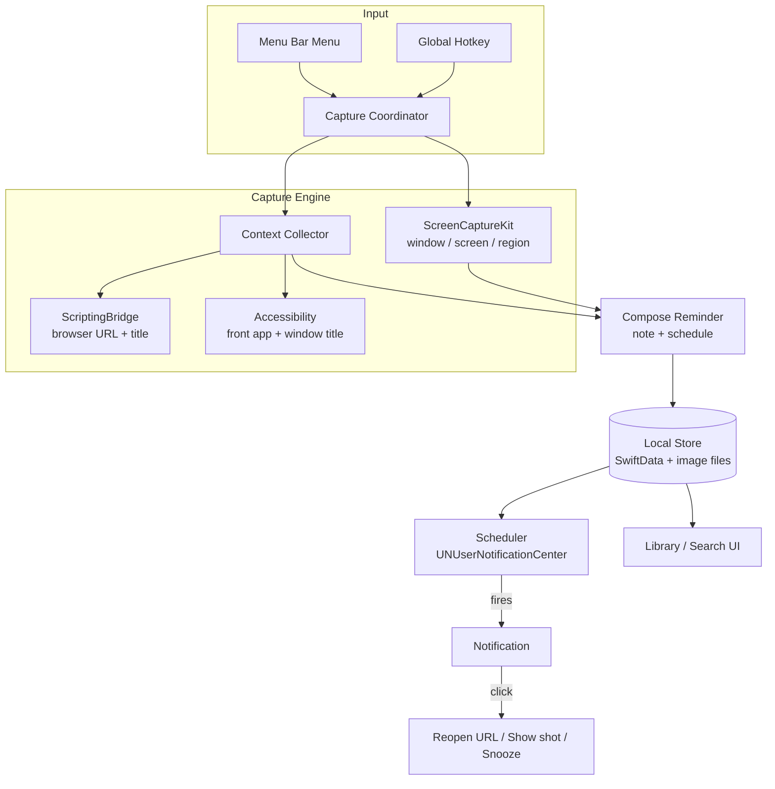

# Remind Anything — macOS App Design Doc

> Capture anything on your screen (a browser tab, an app window, or a region),
> attach a note, and get reminded later — with enough context (URL, window,
> timestamp) to instantly pick up where you left off.

- **Status:** Draft
- **Author:** Meng Zhang
- **Platform:** macOS 13 Ventura+ (targets ScreenCaptureKit APIs)
- **Distribution:** Notarized DMG via **Homebrew Cask** (`brew install --cask remind-anything`), unsandboxed

---

## 1. Problem & Goals

We often see something we want to revisit — a page, a Slack message, a design,
an error dialog — but lose the context by the time we come back. Browser-only
tools can't see other apps, can't fire when the browser is closed, and require a
picker dialog on every capture.

### Goals

- One-shortcut capture of **any** window, screen, or region — no per-shot picker.
- **Region selection always available**, even when the source is a browser tab —
  the URL context is still captured alongside the cropped region.
- Automatically bundle **context**: screenshot + browser URL + window title +
  frontmost app + timestamp.
- Schedule a **reminder** (absolute time, relative delay, or recurring) that
  fires even when browsers are closed.
- Clicking a reminder **reopens the exact page** (if it was a browser tab) and
  shows the screenshot + note.
- Fast, keyboard-driven, lives in the menu bar.

### Non-Goals (v1)

- Cloud sync / multi-device.
- Team sharing / collaboration.
- Windows / Linux support.
- OCR / AI summarization of screenshots (future).

---

## 2. User Stories

- *As a user*, I press a global hotkey while looking at a Chrome tab, add "review
  this PR tomorrow 9am", and next morning a notification reopens that exact PR.
- *As a user*, I capture a region of a Figma window, note "fix this spacing", and
  get reminded in 2 hours.
- *As a user*, I capture a Slack error and set a recurring "every Monday" check.
- *As a user*, I browse a gallery of past captures, search by note/URL, and snooze
  or complete reminders.

---

## 3. High-Level Architecture



### Components

| Component | Responsibility | Key APIs |
|---|---|---|
| **Menu Bar App** | Entry point, status item, quick menu | `NSStatusItem`, `MenuBarExtra` (SwiftUI) |
| **Hotkey Manager** | System-wide global shortcuts | `CGEvent` tap / [`KeyboardShortcuts`](https://github.com/sindresorhus/KeyboardShortcuts) lib |
| **Capture Engine** | Grab window/screen/region silently | `ScreenCaptureKit` (`SCScreenshotManager`, `SCShareableContent`) |
| **Context Collector** | Pull URL + window + app context | `ScriptingBridge`, `AXUIElement`, `NSWorkspace` |
| **Compose UI** | Note + reminder scheduling panel | SwiftUI floating panel (`NSPanel`) |
| **Store** | Persist reminders + images | `SwiftData` (metadata) + files (PNGs) |
| **Scheduler** | Fire notifications, handle actions | `UNUserNotificationCenter` |
| **Library UI** | Browse / search / manage | SwiftUI `List` + search |

---

## 4. Capture Flow (detail)

1. User triggers hotkey (e.g. ⌥⇧2) or picks a menu item.
2. Capture Coordinator determines mode (each has its own hotkey, defaulting to
   region so it's the fast path):
   - **Region** *(default)* — overlay a crosshair selection (borderless
     `NSWindow`); drag to crop. **Works over any source, including a browser
     tab** — the crop is just the pixels, while context (incl. URL) is collected
     independently in step 3.
   - **Frontmost window** — grab the active window directly (no drag).
   - **Full screen** — capture the display under the cursor.
3. **In parallel** (regardless of capture mode), Context Collector snapshots:
   - Frontmost app (`NSWorkspace.frontmostApplication`).
   - Window title (Accessibility / `SCShareableContent`).
   - If frontmost app is a supported browser → active tab **URL + title** via
     ScriptingBridge — **even for a region crop of a browser tab**.
4. Compose panel appears with the thumbnail + auto-filled context; user types a
   note and picks a schedule.

> **Key point:** region selection and context capture are decoupled. Cropping a
> small area of a Chrome tab still records that tab's URL, so the reminder can
> reopen the page *and* show exactly the region you cared about.
5. Persist `Reminder` + save PNG to `~/Library/Application Support/RemindAnything/captures/`.
6. Register a notification request with the Scheduler.

### Browser context strategy

| Browser | URL source |
|---|---|
| Chrome / Brave / Edge / Arc / Chromium | ScriptingBridge `activeTab.URL` |
| Safari | ScriptingBridge `frontDocument.URL` |
| Firefox | Accessibility fallback (address-bar `AXValue`) |
| Other / no browser | URL omitted; window title used as context |

> Proven in `demo/browser_context.py` — the same AppleScript calls, wrapped in
> typed ScriptingBridge for speed and to avoid `osascript` spawns.

---

## 5. Data Model

```swift
@Model
final class Reminder {
    var id: UUID
    var createdAt: Date

    // Capture
    var imagePath: String          // relative path to PNG
    var thumbnailPath: String?

    // Context
    var sourceApp: String?         // e.g. "Google Chrome"
    var windowTitle: String?
    var url: URL?                  // present when captured from a browser
    var pageTitle: String?

    // User input
    var note: String

    // Scheduling
    var scheduleKind: ScheduleKind // .absolute / .relative / .recurring
    var fireDate: Date
    var recurrenceRule: String?    // RFC 5545-ish, optional
    var snoozedUntil: Date?

    // State
    var status: ReminderStatus     // .scheduled / .fired / .done / .snoozed
}
```

- **Metadata** in SwiftData (queryable, searchable).
- **Images** as files on disk (SwiftData/DB shouldn't hold large blobs).
- Thumbnails generated at capture time for fast library scrolling.

---

## 6. Scheduling & Notifications

- Use **`UNUserNotificationCenter`** with `UNCalendarNotificationTrigger`
  (absolute/recurring) or `UNTimeIntervalNotificationTrigger` (relative).
- Notification includes: thumbnail attachment, note as body, source app/site.
- **Actions** on the notification:
  - **Open** → reopen `url` (or reveal screenshot if none).
  - **Snooze** → +10m / +1h / tomorrow.
  - **Done** → mark complete.
- App registers as a **Login Item** (`SMAppService`) so reminders fire without
  manual launch — this is what beats the browser-extension "only while Chrome
  runs" limitation.
- On launch, reconcile: re-register any pending reminders (notifications can be
  lost across reboots).

---

## 7. Permissions & Privacy

| Feature | Permission | Prompt timing |
|---|---|---|
| Screenshot window/screen/region | **Screen Recording** | First capture |
| Read window titles / focused element | **Accessibility** | First non-browser capture |
| Read browser URL (AppleScript) | **Automation** (per browser) | First capture from that browser |
| Notifications | **Notifications** | First reminder |

Privacy stance:
- **100% local.** No network calls in v1. Images and DB stay on device.
- Clear onboarding screen explaining each permission and *why*.
- Graceful degradation: if Automation is denied, still capture image + window
  title, just without the URL.

---

## 8. Tech Stack

- **Language:** Swift 5.9+, **SwiftUI** (menu bar + panels + library), AppKit
  interop for panels/overlays.
- **Capture:** ScreenCaptureKit.
- **Context:** ScriptingBridge, ApplicationServices (AX), NSWorkspace.
- **Storage:** SwiftData; `FileManager` for images.
- **Notifications:** UserNotifications framework.
- **Hotkeys:** `sindresorhus/KeyboardShortcuts` (SPM) or custom `CGEventTap`.
- **Build/Dist:** Xcode, code signing + **notarization**, DMG via `create-dmg`,
  published as a **Homebrew Cask** (own tap or `homebrew-cask` once eligible).

---

## 9. UI Surfaces

1. **Menu bar item** — icon + dropdown: Capture Window / Region / Screen,
   Open Library, Preferences, Quit.
2. **Compose panel** — floating, non-activating `NSPanel`: thumbnail, editable
   context chips (app / URL / title), note field, schedule picker (segmented:
   At / In / Every), Save.
3. **Library window** — grid/list of captures with search (note + URL + app),
   status filters, per-item snooze/done/delete, "reopen" button.
4. **Preferences** — hotkey bindings, default reminder, launch-at-login toggle,
   permission status + re-request buttons.

---

## 10. Milestones

| Phase | Deliverable |
|---|---|
| **M0 – Spike** | Menu bar app + global hotkey + ScreenCaptureKit region/window grab to PNG |
| **M1 – Context** | Bundle URL/title/app/window into a capture (port the Python demo to ScriptingBridge) |
| **M2 – Reminders** | Compose panel + SwiftData store + UNUserNotifications (absolute/relative) |
| **M3 – Library** | Browse/search/snooze/done + reopen URL action |
| **M4 – Polish** | Recurring reminders, onboarding/permissions UX, login item (region capture lands in M0/M1 as the default mode) |
| **M5 – Ship** | Signing, notarization, DMG, **Homebrew Cask tap**, auto-update (Sparkle, optional) |

---

## 11. Open Questions

- **Region capture editor** — do we want annotation (arrows/text) in v1 or later?
- **Recurring rules** — how expressive (simple presets vs. full RRULE)?
- **Auto-update** — rely on `brew upgrade --cask` for updates, add Sparkle for
  non-brew users, or both? (Cask requires a notarized build + a stable download
  URL / versioned release; a personal tap `homebrew-remind-anything` is the
  fastest start before applying to the official `homebrew-cask`.)
- **Naming / bundle ID** — needed for signing + per-browser Automation entitlements.
- **Firefox priority** — is the Accessibility fallback worth building for v1?

---

## 12. Future Ideas

- iCloud sync of reminders + captures.
- OCR + on-device search inside screenshots.
- "Smart" reopen: restore not just the URL but scroll position (browser extension companion).
- Quick capture → share to Slack/Notion.
- Natural-language scheduling ("next Tuesday morning").
