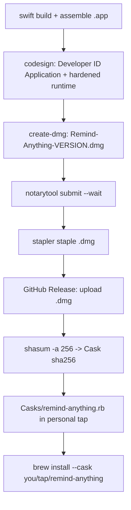

# Publishing Remind Anything via Homebrew Cask

This document describes the **paid / notarized** distribution path: sign with a
Developer ID certificate, notarize + staple, package a DMG, publish a GitHub
Release, and install through a Homebrew Cask.

> **Why notarization is required.** As of Homebrew 5.0 (Nov 2025), `brew` no
> longer strips the Gatekeeper quarantine bit (`--no-quarantine` is deprecated),
> and **all casks that fail Gatekeeper checks are removed from the official tap
> after September 1, 2026**. Apple Silicon also refuses to run un-notarized,
> downloaded binaries cleanly. A notarized build is therefore the only path that
> installs and launches with no manual `xattr` step. See
> [`docs/homebrew-notes.md`](#references) links at the bottom.

---

## 0. Overview



The current `Scripts/build_app.sh` already produces a **hardened-runtime** bundle
and accepts `--sign "Developer ID Application: …"`. The remaining pieces to build
are: DMG packaging, notarization, release upload, and the Cask formula.

---

## 1. One-time prerequisites

| Requirement | How |
|---|---|
| **Apple Developer Program** ($99/yr) | Enroll at <https://developer.apple.com/programs/> |
| **Developer ID Application certificate** | Xcode → Settings → Accounts → Manage Certificates → `+` → *Developer ID Application*. Verify with `security find-identity -p codesigning`. |
| **Notary credentials stored in keychain** | `xcrun notarytool store-credentials "RemindAnything-Notary" --apple-id "you@example.com" --team-id "TEAMID"` (uses an app-specific password) — or use an App Store Connect API key. |
| **`create-dmg`** | `brew install create-dmg` |

Record your Team ID and the exact identity string, e.g.
`Developer ID Application: Meng Zhang (ABCDE12345)`.

---

## 2. Bump the version

Update **both** keys in `App/Info.plist` for each release:

- `CFBundleShortVersionString` — marketing version (e.g. `1.0.0`), used by the Cask.
- `CFBundleVersion` — monotonically increasing build number (e.g. `1`).

Tag matches the version: `v1.0.0`.

---

## 3. Sign

```sh
Scripts/build_app.sh --sign "Developer ID Application: Meng Zhang (ABCDE12345)"
```

Verify the signature and hardened runtime:

```sh
codesign --verify --deep --strict --verbose=2 "dist/Remind Anything.app"
codesign -dv --verbose=4 "dist/Remind Anything.app" 2>&1 | grep -E 'Authority|flags'
# flags should include: runtime
```

---

## 4. Package the DMG

Produce `dist/Remind-Anything-<version>.dmg` with a drag-to-Applications layout:

```sh
create-dmg \
  --volname "Remind Anything" \
  --app-drop-link 480 170 \
  --icon "Remind Anything.app" 160 170 \
  --window-size 640 360 \
  "dist/Remind-Anything-1.0.0.dmg" \
  "dist/Remind Anything.app"
```

> **TODO (scripts):** wrap this in `Scripts/make_dmg.sh` that reads the version
> from `App/Info.plist` so the filename stays in sync.

---

## 5. Notarize + staple

```sh
xcrun notarytool submit "dist/Remind-Anything-1.0.0.dmg" \
  --keychain-profile "RemindAnything-Notary" \
  --wait

# On "Accepted", staple the ticket into the DMG so it validates offline:
xcrun stapler staple "dist/Remind-Anything-1.0.0.dmg"
```

Validate the end-user experience:

```sh
spctl -a -t open --context context:primary-signature -v "dist/Remind-Anything-1.0.0.dmg"
# expected: source=Notarized Developer ID  ...  accepted
```

If notarization fails, fetch the log with the submission ID:

```sh
xcrun notarytool log <submission-id> --keychain-profile "RemindAnything-Notary"
```

Common causes: a nested binary not signed with the hardened runtime, or missing
`--options runtime` (already handled by `build_app.sh`).

> **TODO (scripts):** `Scripts/notarize.sh <dmg>` for submit + wait + staple + verify.

---

## 6. Publish a GitHub Release

The Cask needs a **stable HTTPS download URL**. GitHub Releases are the simplest.

```sh
VERSION=1.0.0
gh release create "v${VERSION}" \
  "dist/Remind-Anything-${VERSION}.dmg" \
  --title "Remind Anything ${VERSION}" \
  --notes "Release notes here."

# Compute the checksum for the Cask:
shasum -a 256 "dist/Remind-Anything-${VERSION}.dmg"
```

Download URL pattern:
`https://github.com/<owner>/remind-anything/releases/download/v<version>/Remind-Anything-<version>.dmg`

---

## 7. Personal Homebrew tap

Fastest route that works immediately (no notability review needed).

1. Create a repo named `homebrew-tap` under your account (the `homebrew-` prefix
   is what makes `brew tap` recognize it).
2. Add `Casks/remind-anything.rb`:

```ruby
cask "remind-anything" do
  version "1.0.0"
  sha256 "PASTE_SHA256_HERE"

  url "https://github.com/<owner>/remind-anything/releases/download/v#{version}/Remind-Anything-#{version}.dmg"
  name "Remind Anything"
  desc "Capture anything on screen, attach a note, get reminded with context"
  homepage "https://github.com/<owner>/remind-anything"

  depends_on macos: ">= :sonoma" # macOS 14+, matches LSMinimumSystemVersion

  app "Remind Anything.app"

  zap trash: [
    "~/Library/Application Support/RemindAnything",
    "~/Library/Preferences/com.mengzhang.RemindAnything.plist",
  ]
end
```

3. Install / test locally:

```sh
brew tap <owner>/tap
brew install --cask <owner>/tap/remind-anything

# Audit the cask before publishing changes:
brew audit --cask --new <owner>/tap/remind-anything
brew style <owner>/tap/remind-anything
```

Users then install with:

```sh
brew install --cask <owner>/tap/remind-anything
```

---

## 8. (Optional, later) Submit to the official homebrew-cask

Only worthwhile once the app has a stable release history and meets the
[Acceptable Casks](https://docs.brew.sh/Acceptable-Casks) notability rules
(popularity/notability thresholds). The Cask above is largely reusable; open a
PR against `Homebrew/homebrew-cask`. Until eligible, keep the personal tap.

---

## 9. Release checklist

- [ ] Bump `CFBundleShortVersionString` + `CFBundleVersion` in `App/Info.plist`.
- [ ] `Scripts/build_app.sh --sign "Developer ID Application: … (TEAMID)"`.
- [ ] `codesign --verify --deep --strict` passes; `flags=…runtime`.
- [ ] Build DMG (`create-dmg`).
- [ ] `notarytool submit --wait` → **Accepted**; `stapler staple`.
- [ ] `spctl -a -t open …` → **accepted / Notarized Developer ID**.
- [ ] `gh release create v<version>` with the stapled DMG.
- [ ] Update `version` + `sha256` in `Casks/remind-anything.rb`; push tap.
- [ ] `brew audit --cask` + fresh `brew install --cask` smoke test.

---

## 10. Follow-up automation (not yet built)

Scripts to add under `Scripts/` to make releases one command:

- `make_dmg.sh` — version-aware DMG packaging.
- `notarize.sh` — submit + wait + staple + verify.
- `release.sh` — build (signed) → dmg → notarize → staple → `gh release` → print sha256.
- Optional GitHub Actions workflow triggered on `v*` tags (requires the
  Developer ID cert + notary credentials stored as encrypted repo secrets).

There is **no auto-update** mechanism (Sparkle); updates flow through
`brew upgrade --cask`.

---

## References

- Homebrew 5.0.0 announcement — <https://brew.sh/2025/11/12/homebrew-5.0.0/>
- Removing `--no-quarantine` support — <https://github.com/Homebrew/brew/issues/20755>
- Acceptable Casks — <https://docs.brew.sh/Acceptable-Casks>
- Notarizing with `notarytool` — <https://developer.apple.com/documentation/security/notarizing-macos-software-before-distribution>
